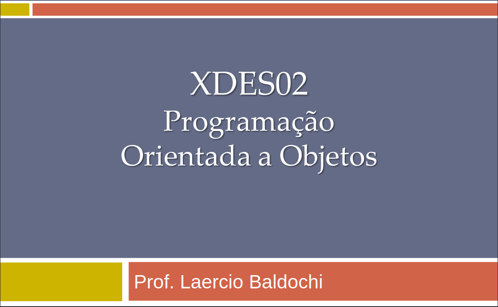

# Repositório da Disciplina **XDES02 - Programação Orientada a Objetos**

## Descrição
Este repositório contém materiais, códigos e arquivos relacionados à disciplina **XDES02 - Programação Orientada a Objetos**. 

## Conteúdo
- **Trabalhos e Exercícios**: Implementações e códigos práticos desenvolvidos durante a disciplina.
- **Materiais Complementares**: Documentos e PDFs de apoio.

---

Desenvolvido para a disciplina **XDES02 - Programação Orientada a Objetos**.
